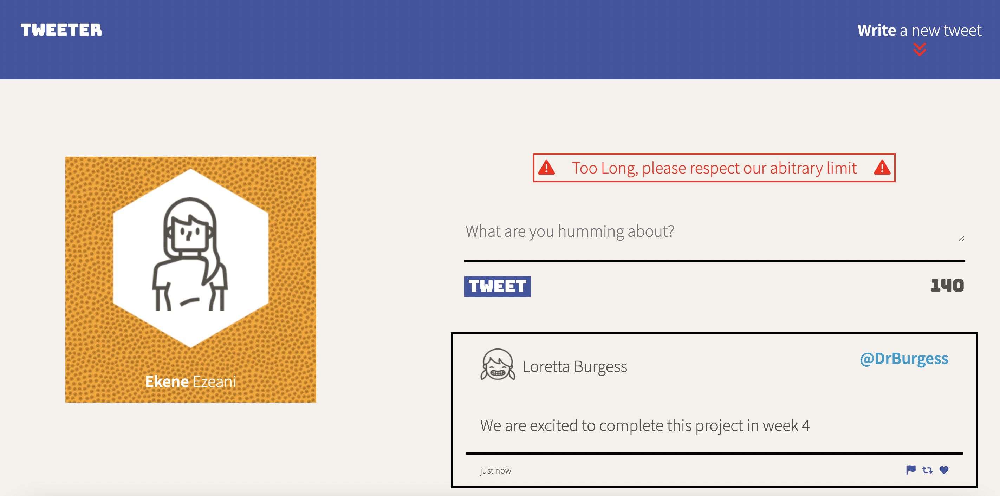
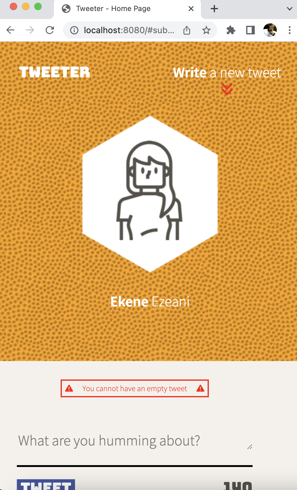
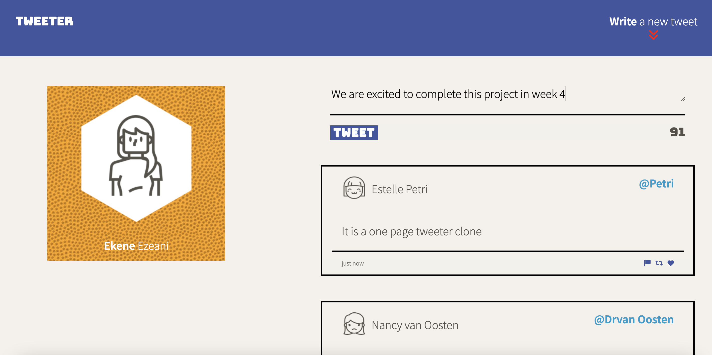

# Tweeter Project

Tweeter is a simple, single-page Twitter clone.

## Project Summary
1. It takes in a user's tweet and renders the new tweet immediately without refreshing the browser.
2. This app is adapted for different screen sizes.
3. There is a built-in code to prevent Cross Site Scripting.
4. User input is validated and an appropriate error message is displayed.

## Screen Shots

## Getting Started

1. [Create](https://docs.github.com/en/repositories/creating-and-managing-repositories/creating-a-repository-from-a-template) a new repository using this repository as a template.
2. Clone your repository onto your local device.
3. Install dependencies using the `npm install` command.
3. Start the web server using the `npm run local` command. The app will be served at <http://localhost:8080/>.
4. Go to <http://localhost:8080/> in your browser.

## Dependencies

- Express
- Node 5.10.x or above
